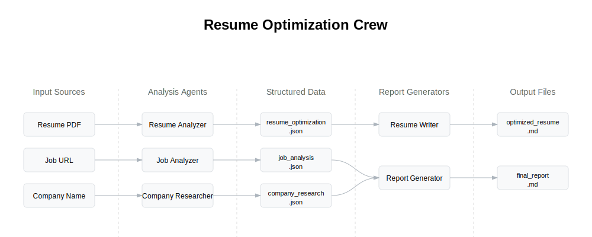

# Resume Optimization System

This project is a resume optimization system built using the CrewAI framework. It helps job seekers optimize their resumes for specific job postings by analyzing the job requirements, the candidate's resume, and the target company.

## Project Structure

1. __Main Components__:

   - `main.py`: Entry point that initializes the crew with job URL and company name
   - `crew.py`: Defines the ResumeCrew class with agents and tasks
   - `models.py`: Defines Pydantic data models for structured outputs
   - Configuration files in `config/`: Define agent roles and task descriptions
   - Custom tools in `tools/`: Template for extending functionality

2. __Agents (AI Specialists)__:

   - __Resume Analyzer__: Analyzes the resume and provides optimization suggestions
   - __Job Analyzer__: Analyzes job descriptions and scores candidate fit
   - __Company Researcher__: Researches companies and prepares interview insights
   - __Resume Writer__: Creates optimized resumes in markdown format
   - __Report Generator__: Creates comprehensive reports from all analyses

3. __Tasks (Sequential Process)__:

   - __Analyze Job__: Extracts requirements and scores candidate fit
   - __Optimize Resume__: Provides structured optimization suggestions
   - __Research Company__: Gathers company information and interview preparation
   - __Generate Resume__: Creates an optimized resume in markdown
   - __Generate Report__: Creates a comprehensive final report

4. __Data Flow__:

   - Input: Job URL, company name, and candidate's resume (PDF)
   - Processing: Sequential execution of tasks by specialized agents
   - Output: JSON analysis files and markdown documents in the `output/` directory

5. __Tools Used__:

   - __SerperDevTool__: For web searches (used by Company Researcher)
   - __ScrapeWebsiteTool__: For scraping job descriptions (used by Job Analyzer)
   - __PDFKnowledgeSource__: For reading and analyzing the resume PDF

## How It Works

1. The system takes a job URL (LinkedIn job posting) and company name as inputs
2. The Job Analyzer scrapes and analyzes the job posting, extracting requirements and scoring candidate fit
3. The Resume Analyzer examines the candidate's resume and provides optimization suggestions
4. The Company Researcher gathers information about the company for interview preparation
5. The Resume Writer creates an optimized resume based on the analysis
6. The Report Generator creates a comprehensive report with all findings and recommendations

## Output Files

- `job_analysis.json`: Detailed job requirements and candidate fit scoring
- `resume_optimization.json`: Specific suggestions for resume improvement
- `company_research.json`: Company information and interview preparation
- `optimized_resume.md`: The optimized resume in markdown format
- `final_report.md`: Comprehensive report with all analyses and recommendations
